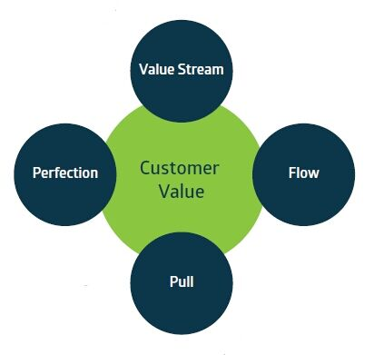
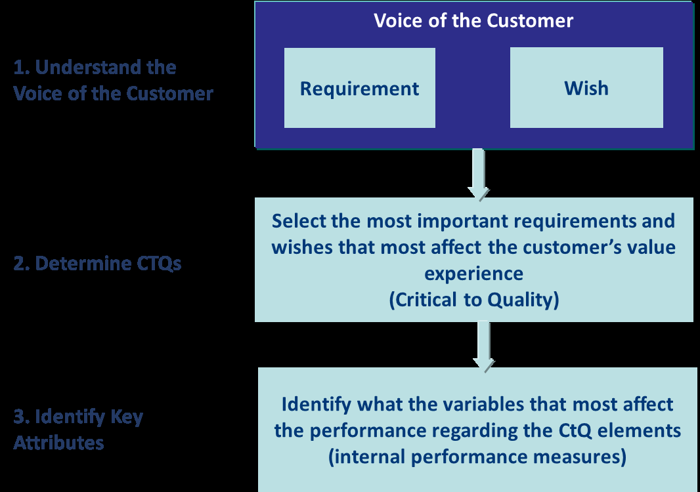

# 精益IT基础--提升IT的价值

## 目的

本文档的目的是给精益IT基础认证提供支持。考试中的问题都能基于本文档中的知识解答。

#### 目标读者

1. 精益IT基础认证的报考者
2. 受认证的培训机构

## 前言

早在编写《精益IT-建立和维持你的精益转型》的2010年，我梦想也许有一天，会有一个能够鉴别应用精益IT能力的专业认证。我非常激动，精益IT协会的成立就是为了实现这个梦想并促进、认识、理解和实践精益IT。这个组织的使命是提供面向对精益IT的价值和定位的清晰理解及其相关的迫切需要的知识体系。

精益IT代表我所相信的对于任何组织而言都是最有效的应用--精益的思想、方法和工具。因为我们在信息、沟通和技术上的相互依赖。

精益IT是加快企业向精益转型的支点，因为我们生产的产品和提供的服务的质量实时的反映了我们在人才、信息和技术方面的能力。转型建设体现了我们给客户的价值，反映了我们通过伟大的技术巧妙利用过程和质量信息的能力。基金会认证是建立用于it识别技术标准工作（包含核心术语、方法、功能、流程和工具）的重要一步。在下面的内容中，一个被广泛讨论的精益IT的核心思想是“简洁”。我希望追求精益IT的培训和认证不是你的最终目的，希望本书能够激励你一生不断学习、实践和探索。

## 1.介绍

在完成《精益IT基础》时，我们的目标是给那些想要获得精益知识并在it上应用的人们提供一个广泛的可实践的基本原则。本书的内容提供了精益IT的基础考试。我们选择编写这本书，是为了确保想要获取相关知识和认证的人都能够如愿以偿。我们并不要求备考者购买特定的书籍。在本书的最后，我们提供其他出版物作为深入研究的参考。

在90年代出，呼吁将精益原则应用到IT公司的声音就不断增长。而且，经过了几十年的在生产工业应用和发展，这原则已经扩展到IT服务行业中。这背后的主要推动力就是IT行业常常无法提供客户需要的价值。尽管IT公司试图改进成熟的模型，但在客户眼中他们一直是表现不佳的it服务提供商。

但问题是，这些客户一年比一年更加依赖他们的IT。结果，因为精益的原则已经应用到他们的主要业务中，我们希望精益原则能够对IT同样起作用。我们将会看到，精益的思想是正确的，但精益在IT上的应用有很多特殊之处。总而言之，精益原则在IT上能够使用。我们发现第一个问题是没有对精益IT的准确定义。

精益IT协会将它定义为：”精益IT是精益制造和精益服务原则在管理信息技术产品和服务上的拓展，它的目标是持续提高IT企业向客户提供的价值和IT从业人员的专业精神“

精益IT专注于改善IT从业人员、流程和it技术，以便向客户提供更多的价值。

## 2.精益

精益追根溯源到人们创造产品的欲望。它包含不断进化的概念和对经营业绩的深入思考。自从精益原则在很多情况下被应用，精益的工具和方法有很多来源（不同公司应用的范例），而许多标志性的精益元素来源于丰田生产系统（TPS）。

### 2.1历史

精益的历史开始于当时大多数生产工艺的问题。十九世纪末期，弗雷德里克·泰勒调查工作效率。他的想法包括划分工作和指定任务执行员工，培训员工，这样他们就可以执行这些任务，并安排监督，以确保指定任务进行。泰勒的支持者，亨利·福特推出了可互换零件与标准化工作来创建他所说的移动交通工具的流水线生产。这种类型的生产分工和规范的发展任务。

在1930年代，丰田的人看着这种情况，二战后这样的想法更加强烈了，他们想到一系列的创新可能使它更可能提供流程的连续性和产品供应的多样性。对丰田来说至关重要的是追赶世界其他国家，特别是美国。由于一般意义上的资源稀缺，丰田集中精力在最小化生产汽车所需的原材料和减少采购原材料和发送发票给客户之间的时间。他们的想法最终以“丰田生产系统（TPS）”闻名。这个系统将工程师的焦点从个人机器的利用率转移到产品流水线的总过程上，与客户需求紧密联系在一起。丰田很快发现工厂的工人有远远超出体力劳动的更大的贡献。丰田生产系统(TPS)是基于两个基本原则：准时制生产与自动化。随着丰田的改良，TPS也不断的进步。TPS成为了《丰田模式》（2001年出版）的一部分。到现在，准时制生产与自动化原则依然存在，而丰田模式的哲学有两个更高的原则：尊重人和持续改进。

J·爱德华兹•戴明被视为对日本制造业和商业有巨大的影响。他表明，组织想要提高质量和降低成本、减少浪费、返工、员工流失和诉讼，同时增加客户忠诚度，关键是要实践持续改进并将制造理解成是一个系统，而不是作为一个部分去优化。虽然戴明是Plan-Do-Check-Act (PDCA)的功臣，但他总是把PDCA称之为休哈特周期。PDCA有一个内建的改进周期：一个迭代四个步骤的管理方法用于业务流程与产品的控制和持续改进。

戴明周期或者说哈休特周期是完整精益理念的一部分，体现了持续改进的目标：

1. PLAN：设计或修改业务流程组件来改善结果。
2. DO：实施计划并测量其性能。
3. CHECK：评估测量并将结果报告给决策者。
4. ACT：决定改善程序需要作出的变化。

戴明周期创建了一个反馈循环机制来确保改进是准确的并能够实施。

### 2.2  Six Sigma与精益之间的关系

起源于1980年代的摩托罗拉，Six Sigma在今天已经广泛应用到许多工业部门。Six Sigma是一个用来消除影响用户忠诚度的可变性、缺陷和浪费的严格的、数据驱动的方法。Six Sigma能通过提高性能和减少流程变化来帮助改善项目，减少缺陷并快速提升利润、员工士气和产品质量。

方法之一是，受到PDCA周期的启发的DMAIC (Define定义， Measure 测量，Analyze 分析，Improve 改善 and Control 控制)。Six Sigma在结合精益中被经常提到。这两个概念有很大的重叠，然而不同的方面有不同的特点。Six Sigma是用自律、数据驱动的方法来消除变量。精益IT主要集中在建立价值流，特别是结合与人相关的的行为和态度。然而，精益IT也利用了Six Sigma中的一些元素，比如问题解决周期--DMAIC。

虽然很大程度上仍然与丰田相关，精益在继续发展成一个独立的概念。尽管最初发展于制造业，这一概念已在其他功能和行业得到证明，比如财务、人力资源、保险、银行、医疗和IT。

### 2.3 缺乏

精益在资源（时间、金钱、人才或材料）缺乏的环境中茁壮成长。丰田的开创新想法来自于一次经历，他们仅仅因为没有足够的原材料导致不能生产库存，除此之外，还导致对减少机器安装时间的持续关注。资源的稀缺性是精益发展的原因，也是应用精益原则和使用精益工具的理由。

在IT行业中，关键的稀缺资源是时间。因为IT是所谓“知识工作”，知识工作者的生产力成为了理解的关键。在计算效率时，时间是一个重要的因素。在IT行业中，我们似乎“太忙于解决文档是否恰当的事情”、“没有时间为完成变更使项目正常运转”、“没有时间改善”，或者我们“必须测试导致延期交货”。时间的稀缺是驱动改进机会的重要因素。精益会有助于充分利用资源，IT行业也一样。

### 2.4 精益关键概念

精益，从本质上说是一种思维和行为的方式。它围绕着如下关键概念：

1. 提高客户价值
2. 在小步骤中持续改进
3. 减少生产中的高峰和低谷
4. 减少浪费
5. 涉及到每个人
6. 发展人
7. 关注长期目标

一旦公司开始用精益原则、概念和技术转型自身，他们需要涉及到全公司的人和地址所需的行为。一个有效的精益转型包含调整我们的工作态度与支持精益工具所需的行为。

### 2.5 做精益

一个公司有各种各样的原因去做到精益。这些原因围绕着三个主要类别：客户满意度、战略价值和经济价值。

首先，精益有助于关注客户价值。通过精益，公司增加产品和服务的价值，同时减少浪费并增加他们的敏捷性和适应能力。一个与客户们和终端用户之间对话的提升能够使IT公司大大增加客户的满意度和忠诚度。

第二，精益公司对流程效益的持续改进提供了巨大的战略价值。他们的服务质量更高，交付时间更短，开发和部署的效率不断提高。对于一个“知识工作”公司来说，最重要的资产就是他的人才：精益承诺更高的员工参与度和主动性。

第三，通过减少流程浪费、优化增值工作（腾出时间来增加价值）能够获得经济利益。同时，减少下单与交付之间的时间将改善现金流。然而，必须要强调，增加利润率不是精益的主要目标，尽管它有提高利润和减少花费在无价值活动精力的副效应。

除了这些原因之外，当前的业务效益也可能给公司提供了一个拥抱精益思想的完整理由。

低质量也是接受精益的驱动力之一。低质量对企业内外都有影响。比如，声誉损害和失去用户信任可能会导致企业蒙受巨大花费或处罚。同时，人才的浪费或者意想不到的其他缺陷使企业内部压力重重。检验、返工和消极怠工又会增加二次成本。

### 2.6 思维模式的转移

精益是一个思维模式转移的结果。它挑战了我们对工作是如何完成与责任是如何被执行的假设。

传统的思维模式是知识就是力量。一个企业可能会发现它自身取决于流程运作知识的几个关键资源。精益企业明白，所有员工不断的参与并最大化的利用信息的透明度能够使它更强大，比如，可视化管理技术。

在传统的背景下，管理层决定需要做什么事情和如何做事情，工人只需要服从命令。这种劳动分工和规范的任务来源于泰勒研究的理解。在精益企业中，管理层在车层面促进工人。他们像是一个教练、一个老师在领导。并且团队负责给用户找出最优化的流程结果。

为了有效的促进一个团队，管理者需要出现在车间--那是工作完成的地方。这种管理行为与传统的管理风格形成了鲜明的对比，在传统管理模式中，管理者只出现在他们的办公室或者会议室—与其他管理者在一起。而这将导致他们与实际发生在车间中的事情失去联系。

传统企业的目标是最大化的利用资源。在IT行业中，这意味着比如程序员这类“昂贵”的员工必须被给予尽可能多的工作来确保时间不被“浪费”。这种想法来源于资源的稀缺性和成本，所以我们必须充分利用他们。然而，它常常会导致效率低下，因为员工生产超出了实际需要，工作弹性降低将员工“填满”。精益企业则首先关注流程效率的最大化，即确保工作任务在通过流程移动，以至可以尽快向客户交付价值。

思维模式转变的另一个方面是人们如何看待缺陷或者错误和如何解决问题。在传统企业中，重点是预防问题的发生。问题是不好的。但与此同时，要接受一些确定的、未定义的、有概率发生的缺陷。精益企业欢迎问题并能从错误中学习。他们使问题变成一次合作的锻炼，并将他们学到的东西在整个企业内分享。由管理层来确保错误是可接受的，并且可以用来不断的提高员工的能力和整个企业。

在面对问题上以及如何防止问题再次发生的开放性态度，是他们持续追求完美的一个坚实基础。

### 2.7 精益IT与IT架构

IT企业出现以来，行业作出了很多努力去标准化并保证高质量服务被交付。框架和标准，特别在IT服务管理领域，旨在确保质量。大多数框架有一些持续改进的元素，然而他们将注意力集中在如何做和做什么上面，而不是方法和改进方法并确保长期的相关和演进。总而言之，这些框架有现有的原则和持续性改进的需要，但是并不足以提供实用的方法和工具去实现它。

在流程框架关系中去理解精益原则的差异性和互补性，你需要理解质量体系与流程框架的区别。

一个由质量体系驱动的改良，以下的逻辑树必须备理解并执行：

1. 什么不是“定义”不能够稳定或可控（精益标准化工作）
2. 什么是“可控”不能够有效测量
3. 什么是“测量”不能够提高

从这个角度看，不同的质量体系开始和结束都有相同的目标，即：建立持续改进的周期或节奏。有很多不同的质量体系可用，比如PDCA周期、全面质量管理体系、精益或者Six SIgma。每个质量体系都有相似的特点。然而，他们依赖于流程框架去提供一个参考模型来解答什么是如何去最好的定义或者测量一个IT流程框架。

关键是各种质量体系和流程框架之间互有依赖和补充。没有质量体系的应用，一个流程框架处于缺乏必要的控制来持续和保持相关的风险之中。同样，没有应用IT管理框架，质量体系也会因为缺乏外部引用最佳实践的参考模型而有失成效，那些参考模型支持了建立最好并共同实践的目标。

最佳IT实践框架应该提供了获得比如架构、服务管理或者安全的方法。他们应该以一个最终状态的图片的方式呈现出一个IT世界和它的路径。不幸的是，大多数IT企业难以达到这个最终状态，这给他们带来一种没有取得进展的感觉。

精益IT是一种只专注于追求用最少的付出交付给客户价值的改善方法。或者，换句话说，精益IT在本质上类似于其他质量体系平衡效果和效率的概念与目标建立一个“适用”的方法，以持续改进。这给人感觉他们可能正在以最有效的方式逐步提供更多的价值。在这个对进步的追求中，最佳的实践框架和标准能给长期愿景提供服务。

结合精益IT和最佳IT实践框架的第二个好处是精益IT带来了对在IT环境中的行为和态度的强烈关注。精益IT被应用到从需求到维护的整个IT领域。应用精益IT涉及整个管理和所有员工。态度和行为元素的改变常常没有明确覆盖在这些框架内，而这恰好是改善所需而没有被提供的工具。因此，精益IT和最佳IT实践框架的结合才非常强大。

精益工具被用来优化过程和减少浪费。最佳的IT实践指引我们如何构造流程。架构、模型、标准和质量体系为改良提供了关于达标情况、良好实践、共同语言和测量的指引。但是，正如大野耐一,TPS（丰田生产系统）之父所说：“如果你你能做最好的标准，那么一切就完了，标准只有做进一步改善这一个底线。”

IT服务管理构建在标准化IT流程的需求上。然而，从精益的角度看，并不是所有的流程都是真正的价值流，下一章我们将讨论一个精益原则。通过使用精益IT，我们能够将注意力集中在正确的流程上去给客户提供最大的价值。

尽管精益IT实践独立的进化，IT服务管理给他们高度的支持，因为有共同的目标。IT服务管理的最佳实践可能是作为精益IT不断更新IT流程的“未来状态”持续相关。精益IT的目标是持续的改良为客户提供的价值。为此，我们在IT的工作中应用精益原则和技巧。这意味着向正确的方向持续的小步前进，而不是试图直接实现一个理想状况。

### 2.8 精益社区

在过去的十年里，有数以讨论精益与精益IT百计的书籍和数千篇文章发表。还有丰富多彩的优秀的协会、咨询公司和教育机构建立在精益的世界里。他们中的许多提供了充满见解、工具、培训命题与认证的网站。有越来越多的人在社区中定期举行讨论精益话题和在原则和方法上面的新应用的集会，这种集会通常被称为精益峰会。

在精益的世界里，Shingo研究所的Shingo模型是最重要的精益标准之一。精益世界也在不断发展。它就在在这里，而且越来越受欢迎。因为所有的工作都成为了流程，而所有的价值都是作为一个流程的结果而交付的，所以精益的应用与所有的行业和企业都是相关的，他的“公分母”是人开展工作。

精益IT在2011年由史蒂芬贝尔和Michael Orzen撰写的精益IT书籍中被突出。这是在多年来人们对在IT中使用精益理念越来越感兴趣之后，许多实践者将精益原则应用于IT组织。

## 3. 精益的关键原则

精益源于丰田生产系统(TPS)，它是一种交付高质量的、能满足客户的需求的产品的系统。TPS的三个基本要素是及时生产，注重质量和持续改进。精益的本质是为客户提供价值，并通过消除产生价值的整个系统的浪费，不断提高实现这一目标的能力。这是一个简单的声明，但却有着深远的影响。精益哲学的里程碑式的出版《精益思想》(Womack and Jones,1996年)，详细阐述了精益的关键原则:

**价值**被定义为客户(“客户”的声音)和代表客户关于产品或服务交付的要求。产品或服务的价值的关键在于它能够帮助产品或服务的用户向他或她的客户交付价值。我们需要持续关注最终客户和他们所感知到的价值。客户对你的组织有价值的需求。如果这种增值不足，客户就会改变供应商。

价值是通过**价值流**交付的。这是由为了确保尽可能快地交付所需价值的客户触发的端到端流程。价值流由所有用于将产品或服务从概念带到客户的所有任务和活动组成，包括所有信息、工作和材料流。

为了交付交付价值的价值流，它一定要**流**，这意味着彼此的活动必须遵循以最小的干扰和最小的中间库存。这意味着要设计流，使进入流的每一个单元都被执行到它的终点而不被中断。结果是,流意味着与所谓的“单件流”工作,即每个单元工作经历它自己的流程。这与成批处理多个工作单元的工作相反，它们是通过一个特定的步骤进行处理的。

流主要有这些类型的浪费:中断传递,检查和等待时间。WIP( work in progress 正在进行中的工作)是实现流的障碍，这是由于工作节奏的不同而产生的。库存可以比客户需求更快地得到工作节奏的结果。流是将正确的材料和正确的信息在正确的地方、正确的时，,给拥有正确的技能的正确的人,每一次,简而言之:及时。

一个警告：即使一个流程拥有流，它对能够确保工作进行的管理需求至关重要，但由于需求变化，仍然可以改变流的流程。同样重要的是，客户可以在价值需要的时候触发价值流。这就是**拉力**（Pull）的本质。一个拉动式生产系统是明确地限制在系统中引入的工作数量的生产系统。在下一个流程真正需要之前，任何东西都不会被生产。对于像IT这样的服务行业来说，这种问题比生产行业要少，因为服务是在生产过程中消耗的，并且通常是在客户请求的时候才开始的。

最后但并非最不重要的是，精益追求**完美**。这并不意味着需要进行多个质量控制，从而导致延迟。这意味着，价值流中的每一位参与者都必须知道他/她的任务和相关的质量要求。完美的本质是一次就做到正确的事情。这方面还确保有一个重点是不断提高交付价值的能力。透明度有助于完美的目标，因为透明度确保了有用的反馈，并且需要反馈来理解交付中不符合期望的地方。我们需要创造一个环境，在这个环境中我们能从错误中吸取教训，吸取教训可以成为持续改善的有力元素，积极性没有立即被扼杀。在提供一个更接近客户真正想要的产品的同时，减少工作、时间、空间、成本和错误的过程是没有止境的。

### 3.1 浪费

当精益应用于其他业务领域，精益IT不仅关注于为客户提供尽可能多的价值。该公司还致力于确保那些经常掩盖客户价值的浪费被移除。在这里,为客户增加价值体现在两个方面:减少浪费活动的比例、提高增值活动的数量。

浪费在IT中包含传统的 TIMWOOD  浪费类别：运输（Transportation）、库存（Inventory）、 运动（Motion）、 等待时间（Waiting Time）、 流程过度（Overprocessing）、生产过度（Overproduction）、缺陷和返工（Defects & Rework）。在IT行业中，还有一个非常重要的额外浪费：人才。这就是在IT组织中人们的能力不能被充分利用的时候。

1. 运输（Transportation）：工作产品、信息、资料的移动。
2. 库存（Inventory）：WIP( work in progress 正在进行中的工作)、战略级别更高的产品。
3. 运动（Motion）：不必要的物理运动。
4. 等待时间（Waiting Time）：停止或放慢工作的到来。
5. 生产过度（Overproduction）：生产的过多或早于需要。
6. 流程过度（Overprocessing）：过多或不必要的工作。
7. 缺陷（Defects）：返工纠正错误,检查和报废。
8. 天赋（Talent）：未使用的人类创造力和潜力。

传统的浪费（Muda）遗落了另外两个类型：变化性（Mura）和负担过重（Muri）。

Mura（变化性）发生于当工作与拥有正确技能的人的数量不匹配的时候，这就导致了一系列可能的结果。变化性是关于成本、质量或吞吐量时间的波动变化的问题。变化性直接关系到客户需求可能会有很大的变化的事实，例如，IT组织很难预测何时以及多少单位的工作(例如，事件、变更、服务请求)将被接收到。

Muri（负担过重）是由固定的服务时间框架、发布窗口和其他时间约束引起的。能够将团队规模扩大或降低到匹配工作负载的能力也会在灵活性方面发挥作用。大的库存和批量处理机制会导致负担过重和缺乏灵活性，从而降低流程的流动能力。Muri主要是基于政策的浪费。它是由组织选择使用的约束引起的，例如团队组成或大小、组织形式和前面提到的发布窗口。

在从IT组织消除浪费中,至关重要的是管理在解决Mura（变化性）之前刺激Muri（负载过重）的反馈，Muda（传统浪费）紧随其后。试图删除，比如，一个过度的变化（库存浪费）可能被基于策略的选择（比如变化咨询委员会开会频率或者IT服务管理系统本身没有将客户的愿望拉入流程中）阻挠。

### 3.2 使用原则来改进

这五项原则可以作为促进组织改进的指导原则。

序列总是以客户的价值开始。这是所有改进的锚定，客户价值是精益思想的起点。在某种程度上，每一个改进都必须与为客户创造更多的价值有关。

下一步是了解创建该价值的价值流。基于这些知识，可以通过识别和消除价值流中的浪费来对价值流进行改进。有了清晰定义的价值流，目标是在流程中创建流。

由于在价值流中的步骤之间消除了等待时间和库存浪费，流将会得到实现。将拉力（Pull）整合到价值流中通常是下一步，特别是在制造业中。然而在IT行业中这是不同的。作为一个服务行业,它的“生产”是基于拉力式的；IT通常不在事件发生之前解决问题,主要变化是根据客户的要求进行的。事实上，IT很大程度上是基于拉力式的，这意味着客户在IT流程中会立即面对任何效率低下的问题。

最后的原则是完美。这是一个原则，它处于特殊的位置，它不是最后一步，而是必须应用在每一个动作中的东西。

### 3.3 活动的类型

客户对你的组织有价值的需求。这样，他们定义了三种类型的活动：

1. 从客户角度看的增加价值的活动（增值活动）
2. 从客户角度看的不增加价值的活动（非增值活动）
3. 通常根据组织的政策而做的不增加价值的活动（必要非增值活动）

必要非增值活动涉及到一步或者现在对于未来而言必要的产品改变或者后续步骤，合乎政策，缺没有被最终用户注意到。

我们的目标是优化价值增加的活动，减少必要非增值活动，消除非增值活动。除了创造价值以外，任何目标的资源消耗都被认为是浪费。增值活动是客户愿意为之付出的任何行动或过程，并且一次正确执行。

增值活动的例子是：

1. 应用程序开发：为客户提供新功能
2. 操作活动:确保服务正常工作
3. 提供一台笔记本电脑：意味着一个新员工可以开始工作
4. 建议：在IT的使用中提供理解和洞察，帮助决策

必要非增值活动的例子是：

1. 招聘员工：招聘和筛选新人从根本上帮助组织提供价值
2. 金融与会计：这些活动意味着我们能够向对用户提供价值供给经费
3. 应用测试：在产品提交给用户之前确保产品正常工作
4. 传导的问题与根本原因分析来解决事件的根源并防止重现

非增值活动（浪费活动）的例子是：

1. 库存：管理大量积压的事物
2. 比需求的做的更多：提供非必要的功能
3. 返工：软件中的bug与随后的IT事件解决
4. 等待：编程与测试之间的延期
5. 最普遍的非增值：病假

理解活动的性质能够帮助IT人将精力集中在能给客户增值的活动上。必然的结果是，精益以消除非增值活动为目标。如果可能的话，必要非增值活动必须被最优化并减少。

## 4. 精益IT的特征

精益在制造业为何如此成功？制造业主要处理机器,创造产品。越来越多的人的因素被从生产方程中移除;机器人、自动化流程、机械都是旨在消除人类的变化性和确保恒定的质量。机器为效率而生，即他们以一个人类不能媲美的速度制造产品。不幸的是，在这个过程中，他们往往会比人类产生更多的垃圾（人类能很快的适应去重复利用或减少浪费）。机器随后被改进来保证它们能更好的工作，每小时生产更多的产品或者减少每种产品的浪费。这（一般来说）是一个理性的、科学的流程，这个流程用可预测的、结构化的方式处理有形产品的生产。这也相对容易测量产品是如何制造的。经过多次改进迭代，我们的目标是尽力维持每次有1%或2%的改进。这些特征解释了为什么Six Sigma方法论在制造业得到发展。

用这些特征与IT组织做比较时，我们发现了不同的挑战。首先，IT服务是一个无形的实体。即使是服务的核心--软件，也不是你可以拿起来看看的什么东西。只有通过安装和使用，才能理解它的价值。在很大程度上，IT是不可预测的：我们不知道什么时候会失败，也不知道它需要如何改善。在IT中，我们也不常把服务作为整体去测量。我们测量机器的性能，但这只是服务的一部分。“人”的部分很大程度上是无法测量的。这正是IT与制造业的不同：最重要的组件还是提供服务的人。软件行业继续投入去减少人的影响。但在IT服务的失败中，人的因素仍然占了很大的部分。

因此，在IT上应用精益是一个不同的命题。它是关于在人的上应用精益，而不是在机器上。追求完美意味着提高相关人员的专业水平。这意味着提高他们解决问题、在可预见的时间内交付和提供服务和质量、自主工作和团队合作、精通自身业务的能力。除了技能训练之外，还意味着用一个新的心态去关注价值、价值流、拉力和完美。

## 5. 建造精益IT

精益原则对所有希望将原则融入他们日常工作的组织产生深远影响。为了分析和改善IT组织的一个更易于管理的前景，我们选择用多种考量和定位工具来定义维度。精益的维度是客户、流程、绩效、组织与行为和态度。维度之外，我们需要一个实施持续改进的方法。为此，我们使用DMAIC (Define定义， Measure 测量，Analyze 分析，Improve 改善 and Control 控制) 问题解决方法。

### 5.1 精益IT的维度

没有客户就没有业务。任何业务的目标是找到并保持客户。为了保证对于任何业务的改进是有效的，我们需要先从客户的观点出发。**客户**维度处理了解客户和他们正在寻求的价值的各个方面,包括工具,如【客户的声音】和【质量的关键】。

一旦我们找到客户，IT组织需要执行一系列的活动来使产品和服务的客户愿意买单。**流程**关注价值是如何通过价值流交付的、整合流、拉力与完美的原则。使用SIPOC(Supplier-Input-Process-Output-Customer)（供应-输入-流程-输出-客户）和VSM（value-stream-mapping）（价值流程图）工具来确保流程是被正确审视的和有量化数据详细说明的。VSM随后用来鉴定浪费发生在流程中的位置。

完成一个流程需要各种类型的资源,像时间、金钱、人们和他们的天赋,和材料。将这些资源在流程输出需要某种形式的组织。**组织**维度探究的方面是需要确保我们能够引导资源。这包含了由 Performance Dialogue补充的可视化管理技术。同时,我们需要决定为了交付给客户最大的价值如何去组织人。This means understanding the effect of silo-ed organizations versus organizing for customer-orientation。（水平有限没看懂）

**效益**是精益的一个重要方面。从我们对客户价值和过程的理解,我们可以确定需要理解、管理和引导组织的绩效的绩效考核。关键的方面是定义关键性能指标去最起码理解流程的输出、理解和测量在IT组织中时间的使用，最后，确定可用性和劳动力的技能和知识要求。

**行为和态度**被发现是实现精益(和精益IT)最重要的成功因素之一。有大量的文献中提供的工具来帮助引导行为。第一步是为组织内的每个人特别是领导职位的人理解精益行为的主要特征。至关重要的是理解精益IT被期望提供的改进预期会导致失望和幻灭。

这五个维度，因此，在我们的改进活动中有重要性。本课程余下的内容围绕着这五个维度。

当讨论客户维度我们会找到下面问题的答案：我们的客户是谁？他们想要什么？和他们如何为我们的IT服务估值？

当讨论过程维度我们将回答哪些类型的活动被认为是有价值的，哪些不是？我们也通过使用拉力机制识别增加价值流的机会。一种用来不断地改善我们工作方式的强大技术被称为“VSM（价值流程图）”，我们在流程维度中也会讲到。

组织维度需要回答的问题：我们的组织是适合交付最大价值的吗？我们如何确保迅速全面的沟通？我们如何创建和讨论绩效的透明度？

业绩维度中我们将讨论我们应该测量什么，以及如何影响结果。要真正提高绩效，我们需要回答这个问题：如何获得正确的功能和如何导航,使用关键指标。

因为人是我们的IT组织最重要的资产，我们对他们对工作的态度以及他们如何表现感兴趣。为此,我们将回答人们的心态是什么以及如何重塑？我们将讨论如何更有效地协作,如何把我们的文化转变成一个高绩效的公司。

### 5.2 在Kaizen（持续改善）下持续改进

持续改进首先明确地定义在顾客的眼中的价值，包含内部和外部。预期必须清晰、明确地沟通，以便流程是可以满足客户的需要而设计的。

持续改进主要集中在价值流，需要科学的思维和识别和消除浪费的能力。改进的最基本前提是适当的追求目标：把事情做得更好、更快、更便宜，在我们的工作中创造更多的意义，留下一个更健康的生态足迹。

Kaizen（持续改善）是一种解决问题的方法和在组织中渐进的持续改进的基础形式。Kai意味着改变，Zen意味着更好。Kaizen是不断提高：每天、每个人、无处不在。在Kaizen下进行的许多小改进导致以更小的风险实现更快的革新和更多的竞争优势。

解决问题包括五个阶段，从问题陈述到嵌入式的改进实施。这些步骤是：定义、测量、分析、改进和控制，也称为DMAIC。这种方法源于Six Sigma并且已被证明是适合在IT组织调查和解决问题的。

1. 在**定义**步骤中，我们定义问题陈述，描述目标陈述，分析低质量导致的成本、使用SIPOC图定义范围、建立Kaizen计划团队、创建项目章程和规划、获得利益相关者的支持并启动项目。
2. 在**测量**步骤中，我们构建对现有KPI和绩效的理解、发展 Critical to Quality (CTQ) flowdown、写一个数据收集计划，我们试图理解流程的行为和变化，把当前绩效和客户的声音联系起来。
3. 在**控制**步骤中，我们实施持续的测量、我们锚定组织中的变化、我们量化改进、捕捉经验并将其全面的复制。我们编写项目报告并为我们的项目关闭行动。

我们的目标是提高交付给客户的价值。为此，我们应用精益原则和IT工作的技巧。我们用五个维度来支持我们的改进活动的有效性。我们严谨的使用DMAIC步骤来解决问题，并在问题中学习。这就是我们如何做精益IT。这就是我们如何不断改善业务性能。

## 6. 客户

### 6.1 价值

John Bicheno (2008) 在他的著作《The Lean Toolbox for Service Systems》中从价值的经济定义到价值的性质定义总结了各种价值的定义。这显示了价值的概念是多么让人迷惑。为了使价值更加的具体和可用，理解什么类型的价值是客户价值所在很有用。价值往往是由表明产品或服务的特定属性的重要性形容词描述。在某些情况下,这些都是可衡量的。客户需要一个合适级别的相对视图来感知价值。

举个例子,我们可以要求“便宜”的价值。这个词自己带来很多问题：:产品或服务是什么？产品或服务对客户意味着什么？它帮助客户产生更多的业务吗？类似产品或服务的市场价格是多少？客户对“便宜”的看法是什么？等等。

在前面的例子中，“便宜”可以被任意产品或服务的特点替代。比如，产品的性能、及时性、可靠性、适用性、耐用性和美学。这些紧接着是特定功能的要求。对于服务也是一样，客户可能会定义一下种类的价值：能力、准确性、响应能力、访问、交流和可信度。某些类型的产品或服务的价值可能是相同的但也有差异。关键的信息是，理解和定义客户所需的价值并不像看起来那样简单，特别是它恰恰出现在客户正在寻找中，客户说（举个例子）“它必须能够响应”。下面是一个表，包含一些客户认为的产品或服务的价值：

客户可以定义任意数量的产品或服务的特点。这由组织交付的价值决定，通过与客户的互动，哪些特点是被需求的，即如果没有这些特点用户就不会购买产品或者服务或者具有期望“让客户愉悦”潜力的特征。目标是创建一个产品或服务，满足客户的期望。我们希望这将导致在使用IT组织的产品和服务上更高的客户满意度。

### 6.2 客户

在迄今为止的文档中我们多次提到过，但客户是谁？

在一般意义上，我们可以确定两种类型的客户：

1. 使用产品或者服务的顾客
2. 流程中的下一位

第二种类型的客户通常是相对容易识别的，因为我们知道谁从谁那里接收工作。

第一种客户会很让人迷惑。在IT中，客户是谁？他是使用IT服务的人吗？或者他是购买IT产品或服务的人吗？这两种可能在你组织的内外都存在。例如，保险公司的员工为了记录客户的销售订单使用IT服务，并给一个保险公司的客户开出保单。在这种情况下,员工可以看作是IT的客户。也有可能购买保险的人访问网站，致力于通过基于web的应用程序，而不去找保险的保险公司的员工。在这种情况下,购买保险的人是客户。因此，在我们的例子中，基本相同的服务有两个不同的客户：员工与保险买家，因为他们都使用服务。

在精益,只有客户可以定义价值。但永远记住，感谢是每个客户的主观想法，由收集到的需求和愿望组成。这些需求和愿望在新见解和期望下随时间变化。

让我们看一看IT提供的通常的价值。我们已经看到有两组客户：员工和那些通过网络服务购买组织的产品和服务的人。关注员工，我们看到他们想要的三种基本的价值：

1. 确保现有的服务保持工作，而且一旦停止工作，我们希望它恢复的越快越好
2. 经常需要新功能来匹配我的业务发展的方式，请尽快给我新的东西，这样我可以满足我的客户的需求
3. 假设一切顺利的话，我可能需要一些关于我该如何使用IT来提高我的业务的建议。

这三个常规的价值必须以合理的成本交付。

通过购买基于web服务的顾客需求，特别关注前两种的价值。然而他们的需求可能会在易用性或水平的细节偏离员工，由于他们购买产品或服务低水平的复杂性。

### 6.3 质量的关键（Critical to Quality）（CtQ）

客户价值是由需求和愿望组成的。一个需求是产品必须有的一个特定属性，没有这个属性客户 就不会购买。一个愿望是一个锦上添花的属性，这个属性能鼓励客户。

总之，需求和愿望代表了所谓"客户的声音"（Voice of Customer）（VoC）。从VoC来看，组织交付价值时必须给需求和愿望精炼和排优先级，以找到对于客户而言最重要的那些，CTQ方面的那些。在定义CTQs的时候，企业必须定义它们的关键内在属性。属性必须是可测量的。通过这种方式，客户期望转换成可测量的内部目标和活动。与客户的声音相关的CTQ和属性被称为CTQ树。

调查和理解客户的声音和使用CTQ结构的结果是检验和理解端到端客户的经验，与客户期望得到的价值相关。

让我们简要看一个典型的情况。客户表明交货时间需要变得更短。

通过和客户的讨论，很明显有两个重要的驱动需求实现的属性是：可靠性和及时性。清楚地定义这两个术语的含义是很重要的。可靠性可以被解释为按时交货的能力。这种情况下，它关注软件的可靠性，这事实要求尽可能没有bug。

这些属性显示了可用于IT组织实现目标的最重要的措施。

在及时性方面，我们看到，有两个关键属性：可用的开发能力，以及开发流程总是20周(根据发布的安排)。可靠性取决于缺陷的数量。这些属性通常是流程绩效指标，客户的声音中与经济相关的指标。

我们要问的第一个问题是:我们满足来自客户的声音的需求了吗？

1. 如果我们满足了，,那么我们需要进一步调查客户的声音中是否有其他需求或愿望没有实现。
2. 如果我们没有满足，那么我们就要解决这个问题。
3. 如果我们不是很确定，那我们必须测量那些属性并询问客户绩效是不是足够好。

获得CtQ的最后一步是提供战略目标需求的、与客户的声音有关的观点。通过这种方式，IT中的改良操作可以直接关联到一个清晰的商业利益。

### 6.4 调查客户的声音

在结束本节之前,我们需要看看我们如何调查客户的声音。

首先，我们需要关注我们有哪些客户。正如我们前面所述，一个服务可能有两个不同的客户：内部员工和外部客户，取决于服务被部署的方式。细分的客户是很重要的，因为每一部分可能有不同的需求和消费能力，比如高强度用户、很少使用IT服务的客户、专业用户。

第二,有许多的方法来收集客户的声音信息：

1. **观察**。当你的客户在他们的地方使用你的产品或服务的时候，或者他们与你的公司相互作用的时候。看看使用你的产品的客户（用户）是什么样的人
2. **采访**。使用比如焦点小组、面对面或电话采访。得到反馈，确定产品需求或从现有产品得到反馈
3. **调查**。从一个大样本的客户基础收集定性和定量数据
4. **社交媒体**。例如Twitter,Facebook,LinkedIn和其他社交媒体代表特定用户组给“残酷的”诚实反馈组织是如何做的

客户的声音代表了IT组织的客户的需求和愿望，说出来的和没说出的，无论内部的还是外部的。这完全是关于理解我们的处境，没有满足我们客户需求的处境。因此，这是主动改良之源。

主动改良的其他来源有三种：

1. 业务的声音，鉴别改进来帮助组织实现其目标
2. 流程的声音，基于流程绩效鉴别改进
3. 监管者的声音，基于不断变化的法律需求鉴别改进